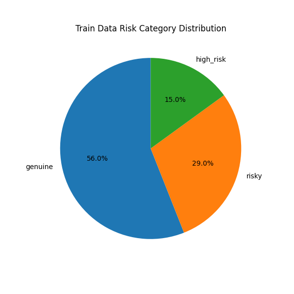
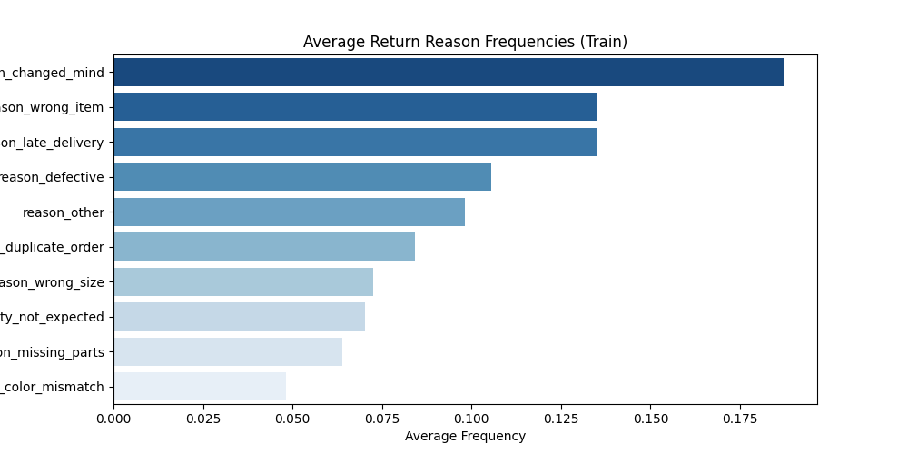
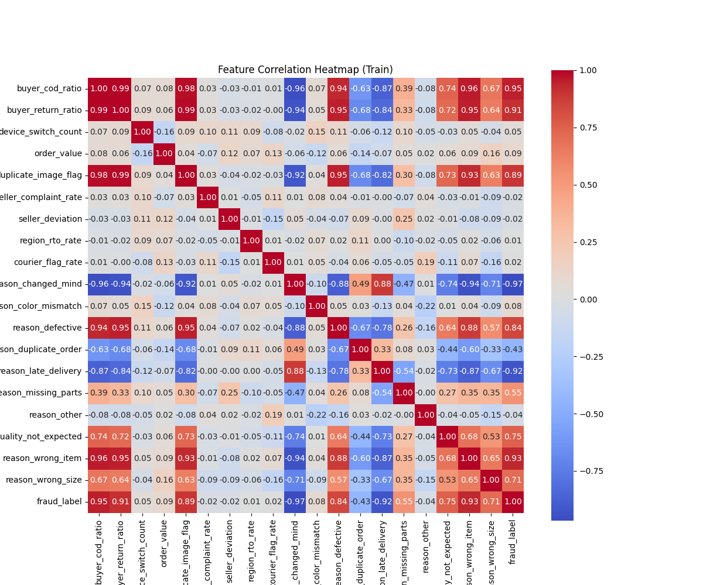
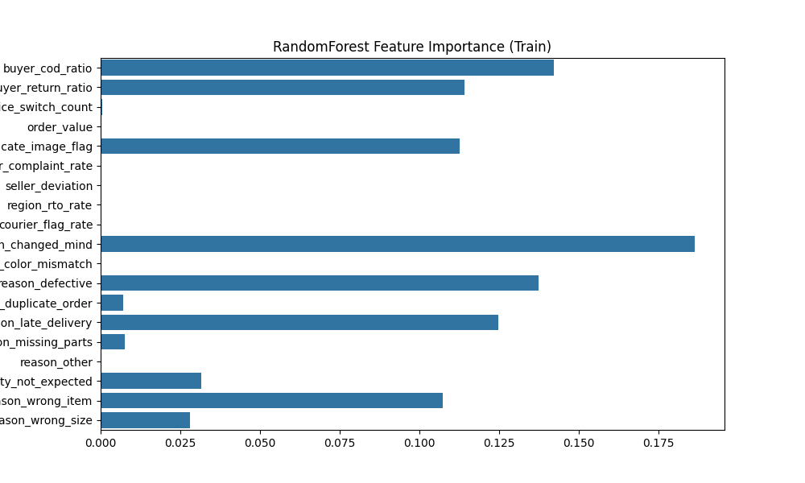
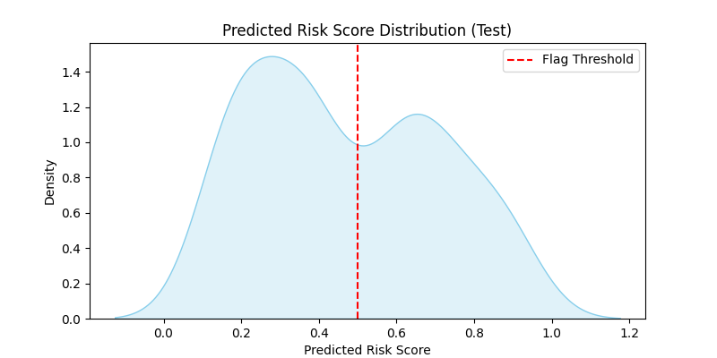
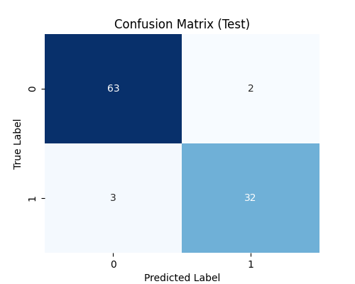
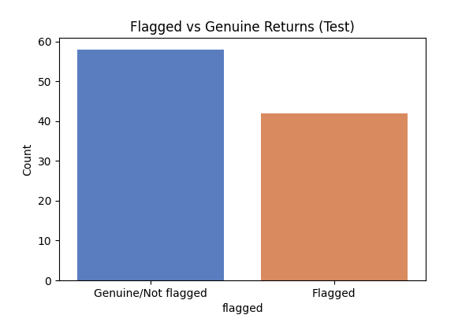

# Meesho Hybrid Return Risk Scoring Framework

This repository contains the implementation and experimental evaluation of a hybrid predictive risk scoring model designed to identify and mitigate fraudulent returns on the Meesho e-commerce platform. The model integrates customer, seller, and regional risk factors to prioritize manual reviews and reduce operational losses caused by returns abuse.

## Project Overview

Meesho’s unique zero-inventory and reseller-driven business model has empowered millions of micro-entrepreneurs but introduced challenges with return fraud impacting profitability and trust. This project proposes a hybrid risk scoring framework that quantitatively assesses buyer behavior, seller return patterns, and regional logistic trends using transactional and return data.

The scoring system computes a composite risk score combining:

- Buyer risk based on return rates, flagged returns, and return reason categories  
- Seller risk derived from normalized deviation from category-level return rates, seller complaints, and flagged returns  
- Regional risk capturing geographic return characteristics and courier-specific issues  

Using synthetic data inspired by Meesho’s operations, the project demonstrates:

- Data generation mimicking customer risk profiles and return behaviors  
- Training of RandomForest-based predictive models on buyer-level aggregated features  
- Evaluation on noisy test return datasets reflecting real-world unpredictability  
- Visualization of feature importance, return reason distributions, prediction scores, and classification performance metrics

## Dataset Details

### Training Dataset (`data/buyer_features_train.csv`)

The training dataset includes aggregated buyer-level features with labeled fraud indicators:

- **Buyer Features:** Return ratios, duplicate image flags, device switch count, average order value  
- **Seller Features:** Seller return rate deviation normalized within region/category, complaint rates  
- **Regional Features:** Regional return-to-origin (RTO) rates, courier flag rates  
- **Return Reason Features:** One-hot encoded categorical reasons for returns  
- **Labels:** Fraud labels indicating genuine (0) or risky/high-risk (1) customers

### Test Dataset (`data/test_return_requests_noisy.csv`)

This dataset simulates real-world variability by adding noise:

- Similar feature set as training but with Gaussian noise added to numeric features  
- 5% of true labels flipped to model label uncertainty and misclassifications  
- Intended to challenge model generalization and robustness evaluation

Raw data generation scripts are not included but can be shared on request.

## Repository Structure

- `data/` : Pre-prepared train and noisy test datasets  
- `src/` : Model training and evaluation scripts (`train_model.py`, `evaluate_on_test.py`)  
- `visualization/` : Optional standalone scripts generating charts and graphs, for train and test data separately
- `notebooks/`: Contains the integrated Jupyter notebook (`risk_model_script.ipynb`) that implements the full workflow—data generation, hybrid return risk model training, evaluation on noisy test datasets, and visualization of results.
- `results/` : Saved visualization results
- `README.md` : This file containing project overview, dataset description, and instructions  
- `requirements.txt` : Python dependencies for reproducibility and environment setup

## Setup and Usage

### Installation

Install required Python libraries:
```pip install -r requirements.txt```


### Training the Model

Train the RandomForest model using the training dataset:

```python src/train_model.py```


### Evaluation

Evaluate the trained model on the noisy test dataset:


```python src/evaluate_on_test.py```


### Visualization

Explore data characteristics and model performance through the visualization script:
For train data -

```python visualization/train_viz.py```

For test data -
```python visualization/test_viz.py```


## Test Evaluation Results

```Test Classification Report:
              precision    recall  f1-score   support

           0       0.90      0.98      0.94        53
           1       0.98      0.87      0.92        47

    accuracy                           0.93       100
   macro avg       0.94      0.93      0.93       100
weighted avg       0.93      0.93      0.93       100

Test ROC-AUC Score: 0.9482135688478522
Saved test risk predictions to 'test_risk_predictions.csv'
```

## Visualizations Results

### Training Data

#### Risk Category Distribution


#### Return Reason Frequencies


#### Feature Correlation Heatmap


#### RandomForest Feature Importance


### Test Data

#### Predicted Risk Score Distribution


#### Confusion Matrix


#### Flagged vs Genuine Returns Counts



## Conclusion
This project develops a hybrid return risk scoring model for Meesho, integrating buyer, seller, and regional data to identify fraudulent returns. The model achieves strong performance on noisy test data, and the results are supported by clear visualizations. All data, code, and analyses are provided for easy replication and extension.


## Authors

- Team Dicerollers.ai  


