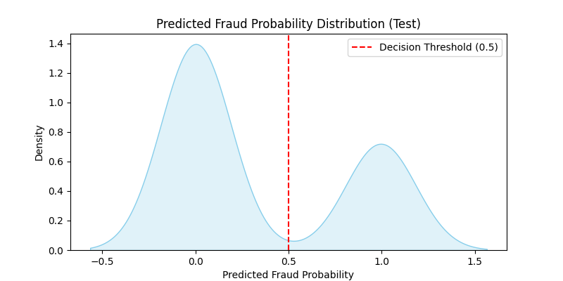
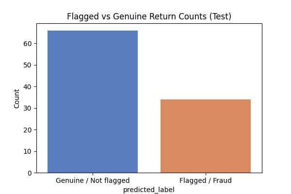

# Meesho Hybrid Return Risk Scoring Framework

This repository contains the implementation and experimental evaluation of a hybrid predictive risk scoring model designed to identify and mitigate fraudulent returns on the Meesho e-commerce platform. The model integrates customer, seller, and regional risk factors to prioritize manual reviews and reduce operational losses caused by returns abuse.

## Project Overview

Meesho’s unique zero-inventory and reseller-driven business model has empowered millions of micro-entrepreneurs but introduced challenges with return fraud impacting profitability and trust. This project proposes a hybrid risk scoring framework that quantitatively assesses buyer behavior, seller return patterns, and regional logistic trends using transactional and return data.

The scoring system computes a composite risk score combining:

- Buyer risk reflected by return rates and detailed return reason categories
- Seller risk derived from normalized deviation of seller return rates within categories and seller complaint rates  
- Regional risk capturing geographic return-to-origin rates and courier-specific issue flags  

This system is trained and validated on synthetic datasets inspired by Meesho’s data patterns using RandomForest predictive models.

Using synthetic data mimicking Meesho’s operations, the project demonstrates:

- Data generation mimicking customer risk profiles and return behaviors  
- Training of RandomForest-based predictive models on buyer-level aggregated features  
- Evaluation on noisy test return datasets reflecting real-world unpredictability with label noise  
- Visualization of feature importance, return reason distributions, prediction scores, and classification performance metrics, including ROC-AUC and confusion matrices


## Dataset Details

### Individual Feature Datasets (Located in `data/` folder)

#### Buyer Features (`data/buyer_features.csv`)

Includes detailed aggregated buyer-level information:

- Buyer Return Ratios: Average proportion of returns made by each buyer  
- Average Order Value: Mean transaction value by buyer  
- Return Reason Categories: One-hot encoded flags for common return reasons (e.g., wrong item, defective)  
- Risk Category Labels: Assigned risk group (genuine, risky, high risk)

#### Seller Features (`data/seller_features.csv`)

Captures seller-related return and complaint statistics:

- Seller Return Rate: Average return proportion for each seller  
- Seller Complaint Rate: Simulated or reported complaint rates per seller  
- Risk Level: Quantile-binned risk classification based on return performance

#### Regional Features (`data/region_features.csv`)

Aggregated return metrics at the regional level for logistic impact assessment:

- Region Return-to-Origin Rate (RTO): Proportion of returns sent back to sender by region  
- Courier Flag Rate: Rate of flagged issues related to courier service  
- Risk Level: Manually assigned risk categories based on RTO and courier flags

---

### Consolidated Training Dataset (`data/consolidated_train_dataset.csv`)

This aggregate dataset merges buyer, seller, and regional features into a unified view, including:

- Aggregated buyer features with detailed return reasons  
- Seller metrics normalized within region or category context  
- Region-level return and logistics risk metrics  
- Derived features such as seller deviation score and composite risk score  
- Fraud labels indicating genuine (0) or risky/high-risk (1) customers

---

### Test Dataset (`data/test_noisy_dataset.csv`)

Represents a noisy real-world-like scenario by:

- Containing the same feature columns as the consolidated training set  
- Adding Gaussian noise to numeric features to simulate measurement variability  
- Flipping 5% of true fraud labels to reflect mislabeling or ambiguous cases  
- Challenging model robustness and generalizability in evaluation

Raw synthetic data generation scripts are not included but can be shared upon request.

## Repository Structure

- `data/` : Contains pre-prepared datasets including consolidated training data, noisy test data, and individual buyer, seller, and regional feature files  
- `src/` : Source code for model training and evaluation scripts (`train_model.py`, `evaluate_on_test.py`)  
- `visualization/` : Standalone scripts for generating visualizations separately for training and test datasets  
- `notebooks/` : Jupyter notebooks implementing the full workflow from model training, evaluation, to visualization (`risk_model_script.ipynb`)  
- `results/` : Output directory for saving generated plots, charts, and model prediction results  
- `README.md` : Project overview, dataset details, usage instructions, and documentation  
- `requirements.txt` : Python library dependencies for environment setup and reproducibility

## Setup and Usage

### Installation

Install required Python libraries:

```pip install -r requirements.txt```


### Training the Model

Train the RandomForest model using the training dataset:

```python src/train_model.py```


### Evaluation

Evaluate the trained model on the noisy test dataset:


```python src/evaluate_on_test.py```


### Visualization

Explore data characteristics and model performance through the visualization script:

For train data -

```python visualization/train_viz.py```

For test data -

```python visualization/test_viz.py```


## Test Evaluation Results

```Test Classification Report:
              precision    recall  f1-score   support

           0       0.95      0.97      0.96        65
           1       0.94      0.91      0.93        35

    accuracy                           0.95       100
   macro avg       0.95      0.94      0.94       100
weighted avg       0.95      0.95      0.95       100

ROC-AUC Score: 0.9408791208791208
```

## Visualizations Results

### Training Data

#### Buyer Risk Category Distribution


#### Return Reason Frequencies (Buyer)


#### Feature Correlation Heatmap


#### RandomForest Feature Importance


### Test Data

#### Predicted Fraud Probability Distribution


#### Confusion Matrix


#### Flagged vs Genuine Return Counts



## Conclusion

This project develops a hybrid return risk scoring model tailored for Meesho, integrating buyer, seller, and regional data sources to effectively identify fraudulent returns. Leveraging synthetic datasets inspired by Meesho’s operational patterns, the model achieves strong performance on noisy test data, demonstrating robustness to label noise and feature variability. Clear and comprehensive visualizations support the analytical results, illustrating feature importance, risk category distributions, and classification outcomes.

All data, code, and analyses are provided to facilitate easy replication


## Future Improvements: Deep Learning Approaches

Our current Random Forest model serves as a robust proof of concept, developed without access to real, large-scale company data. It effectively captures structured patterns in return behavior but has limitations in modeling complex temporal and multi-dimensional interactions inherent to real-world fraud.

Deep learning models offer the ability to learn:

- Intricate sequential behaviors in buyer and seller actions over time.  
- Hierarchical feature representations from structured and unstructured data (e.g., return reason texts, images).  
- Non-linear relationships between diverse features that are hard to capture manually.  
- Multi-modal data integration combining transaction logs, text, images, and metadata.

Specific model architectures we plan to explore include:

- **Buyer Fraud:** Deep Neural Networks (DNNs) that input buyer features to predict fraud probability with nuance.  
- **Seller Risk:** Autoencoders trained on seller return and complaint rates to detect anomalous behaviors indicating potential fraud.  
- **Regional Risk:** KMeans Clustering based on return-to-origin (RTO) and courier flag rates to identify high-risk geographic clusters.  
- **Composite Risk:** A weighted combination of buyer, seller, and regional risk scores to produce a precise overall fraud risk metric.

For example, KMeans based regional risk clusters identification showing region groups with varying risk of return abuse based on RTO rates and courier flags:
<p align="left">
  
</p>

However, the true potential of these advanced methods can only be realized with extensive, feature-rich datasets encompassing detailed transactional histories, customer interactions, and logistic metadata.

Once such comprehensive data is available, deep learning techniques are expected to significantly improve fraud detection accuracy, adaptability, and operational effectiveness—moving beyond the capabilities of ensemble tree-based models.

This positions future work towards gathering richer datasets and experimenting with deep architectures to advance Meesho’s return abuse prevention system.

## Authors

- Team Dicerollers.ai  


